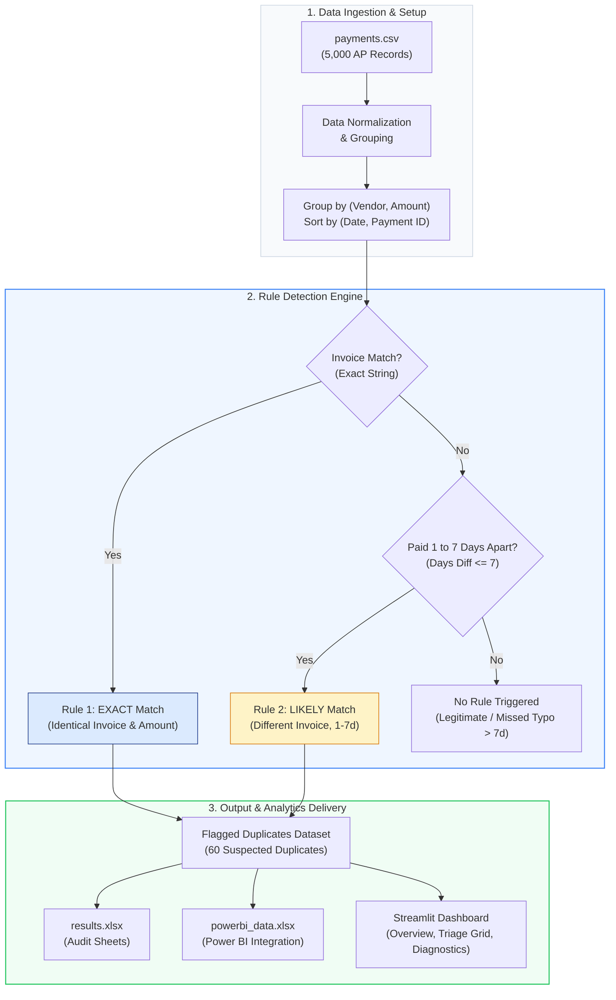

# Duplicate Payment Finder

[](https://ridhimasharma11404-duplicate-payment-finder-app-7wxbxv.streamlit.app/)
[](https://www.python.org/)
[](LICENSE)

Finds vendor payments that were probably made twice.

An audit analytics tool designed for Accounts Payable (AP) substantive testing. It detects suspected duplicate payments, quantifies financial risk, evaluates precision and recall against planted test data, and provides an interactive triage dashboard.

> *Note: Vendor names in the synthetic dataset are illustrative.*

---

## Links

| Resource | Link |
| :--- | :--- |
| Live Dashboard (Streamlit Cloud) | **[ridhimasharma11404-duplicate-payment-finder-app-7wxbxv.streamlit.app](https://ridhimasharma11404-duplicate-payment-finder-app-7wxbxv.streamlit.app/)** |
| GitHub Source Code | **[github.com/RidhimaSharma11404/duplicate-payment-finder](https://github.com/RidhimaSharma11404/duplicate-payment-finder)** |
| Audit Memorandum | **[MEMO.md](MEMO.md)** |
| Audit Results & Error Analysis | **[results.xlsx](results.xlsx)** |
| Power BI Data Model | **[powerbi_data.xlsx](powerbi_data.xlsx)** |
| Test Transaction Dataset (5,000) | **[payments.csv](payments.csv)** |

---

## 1. System Pipeline



---

## 2. Detection Decision Tree


---

## 3. Problem Overview

In accounts payable workflows, duplicate payments represent a direct source of cash leakage. Duplicate disbursements typically arise from:
- Re-submitted invoices following payment inquiries or delayed processing.
- Multi-channel invoice intake (e.g., invoices received via email and vendor portal simultaneously).
- Minor invoice number typographical variations and overlapping payment approval workflows.

Without systematic audit testing, duplicate disbursements often go unnoticed.

---

## 4. Detection Methodology & Rules

The engine implements two deterministic detection rules:

1. **Rule 1 — Exact Match:**
   - Same vendor name, identical invoice number, and exact payment amount.
   - High-confidence duplicate payment instances.

2. **Rule 2 — Likely Match:**
   - Same vendor name and exact payment amount, but different invoice numbers, disbursed within **1 to 7 calendar days** of each other (matching the code implementation in `find_duplicates.py`).
   - Captures duplicate invoice entries processed under alternative reference numbers.

---

## 5. Detection Benchmark & Accuracy

The detection engine was evaluated across a synthetic test population of **5,000 transactions** across 30 illustrative vendors:

| Metric | Value |
| :--- | :--- |
| **Total Test Transactions** | 5,000 payments |
| **Planted Duplicates (Ground Truth)** | 70 payments |
| **Caught Duplicates (by Rules)** | 60 payments |
| **Missed Duplicates** | 10 payments |
| **False Alarms** | 0 payments |
| **Overall Recall Rate (Rules)** | **85.7%** (60 / 70) |
| **Overall Precision Rate (Rules)** | **100.0%** (60 / 60) |
| **Suspected Duplicates Flagged** | 60 payments |
| **Total Capital at Risk** | **INR 14,238,885.84 (~₹1.42 Crore)** |
| **Vendors Affected** | 26 vendors |

### Breakdown by Match Confidence
- **Exact Matches:** 30 disbursements | **INR 6,989,617.91 (~₹69.90 Lakh)**
- **Likely Matches:** 30 disbursements | **INR 7,249,267.93 (~₹72.49 Lakh)**

---

## 6. Error Diagnostics & Miss Root-Causes

- **Missed Duplicates (10 items):**
  - **Typo in Invoice Number with Date Gap > 7 Days (10 cases):** These transactions were planted with typographical formatting differences (e.g., `INV-1001` vs `INV1001`) and paid with a 15–30 day gap. Because exact string equality is enforced by Rule 1, and the date gap exceeds 7 days (bypassing Rule 2), deterministic rules do not capture them.
- **False Alarms (0 items):**
  - Legitimate recurring payments in the dataset were scheduled 30–60 days apart, so Rule 2 did not misclassify them.

---

## 7. Dashboard Features

The web dashboard provides three operational views:

1. **Overview & Trends:**
   - 5 KPI summary cards (Capital at Risk, Suspected Duplicates, Precision, Vendors Affected, Mean Duplicate Value).
   - **Amount at risk by month:** 12-month trend line showing monthly risk distribution.
   - **Cumulative amount at risk:** Cumulative financial exposure curve.
   - **Number of duplicates by amount:** Value tier distribution histogram.
   - **Days apart vs amount:** Scatter plot categorized by match tier.

2. **Suspected Duplicates (Triage Grid):**
   - Multi-select match type filters (`Exact`, `Likely`) and vendor dropdown.
   - Searchable, sorted data table with full transaction metadata.
   - Direct CSV export for audit workpapers.

3. **Detection Accuracy & Errors:**
   - Ground truth validation matrix (Planted, Caught, Missed, False Alarms, Recall %, Precision %).
   - Root-cause breakdown table detailing reasons for missed disbursements.
   - **Rules vs ML (test pairs)** comparative evaluation table.

---

## 8. Machine Learning Step (`ml_step.py`)

To test whether statistical learning can capture invoice formatting variations that bypass rigid string equality rules, a lightweight Machine Learning step (`ml_step.py`) was evaluated on candidate pairs using `StandardScaler` and `LogisticRegression`.

### What the Model Does
1. **Candidate Pair Generation:** Forms pairwise combinations of payments with identical vendor names and an amount difference $\le$ ₹50 (capturing true duplicates, legitimate recurring payments, and random baseline noise).
2. **Feature Engineering:** Computes 5 pairwise features:
   - `days_apart`: Calendar days between disbursement dates.
   - `invoice_similarity`: Character similarity ratio using `difflib.SequenceMatcher`.
   - `amount_difference`: Absolute variance between payment amounts.
   - `same_invoice`: Binary flag (1 if identical invoice strings, else 0).
   - `same_paid_by`: Binary flag (1 if disbursed by the same employee, else 0).
3. **Training & Feature Scaling:** Candidate pairs are split 70/30 (`random_state=42`) stratified by label (107 training pairs, 47 test pairs). Features are standardized using `StandardScaler` fitted on the training set only.
4. **Learned Standardized Coefficients:**

| Feature | Standardized Coef | Direction & Interpretation |
| :--- | :---: | :--- |
| `days_apart` | **-3.2138** | Decreases log-odds of duplicate per standard deviation as payment gap widens |
| `invoice_similarity` | **+0.7056** | Increases log-odds of duplicate per standard deviation with character overlap |
| `amount_difference` | **-1.1850** | Decreases log-odds of duplicate per standard deviation with amount variance |
| `same_invoice` | **+0.6667** | Increases log-odds of duplicate per standard deviation |
| `same_paid_by` | **-0.1408** | Mild negative/neutral weight per standard deviation |
| *Intercept* | **-1.5143** | Base log-odds threshold |

### Test Set Comparison: Rules vs ML (Held-Out Test Pairs)

Comparing both approaches on the exact same **47 held-out test pairs**:

| Approach | Precision | Recall | Typo Duplicates Caught |
| :--- | :---: | :---: | :---: |
| **Detection Rules (Exact + Likely)** | **100.0%** | **81.0%** | **0 / 4** |
| **Logistic Regression ML Model** | **95.5%** | **100.0%** | **4 / 4** |

> **Key Observation:** On the held-out test set, the standardized ML model caught **4 of the 4 typo cases** (with predicted duplicate probabilities ranging from 79.1% to 87.5%), increasing recall on test pairs from 81.0% to 100.0%.

### Limitations
- **Synthetic Data & Optimistic Precision:** These are results on synthetic data, so lower precision is expected on real data. In the synthetic dataset, legitimate repeat payments were planted 30–60 days apart, making them easy to separate from duplicates.
- **Small Test Sample:** The held-out test split comprises 47 candidate pairs (including 4 planted typo cases). While catching 4 of 4 is promising, the sample size is small and performance estimates carry sampling variance.
- **Generator Bias:** The labels originate from the synthetic generation logic, so the model partly reflects the generator's underlying distribution.

---

## 9. Repository Structure

```text
├── .streamlit/
│   └── config.toml          # Dashboard theme configuration
├── LICENSE                  # MIT License
├── MEMO.md                  # Executive Audit Memorandum
├── README.md                # Project documentation and audit methodology
├── app.py                   # Streamlit dashboard application
├── find_duplicates.py       # Rule detection and error analysis engine
├── ml_step.py               # ML candidate pair classifier & evaluation
├── generate_data.py         # Synthetic AP data generator with planted edge cases
├── payments.csv             # 5,000 transaction Accounts Payable test dataset
├── results.xlsx             # Sourced audit findings, error sheets & ML comparison
├── powerbi_data.xlsx        # Structured flat tables for Power BI integration
└── requirements.txt         # Python package dependencies
```

---

## 10. Local Setup & Execution

### 1. Clone Repository
```bash
git clone https://github.com/RidhimaSharma11404/duplicate-payment-finder.git
cd duplicate-payment-finder
```

### 2. Install Dependencies
```bash
pip install -r requirements.txt
```

### 3. Generate Dataset, Run Detection & ML Evaluation
```bash
python generate_data.py
python find_duplicates.py
python ml_step.py
```

### 4. Launch Streamlit Application
```bash
streamlit run app.py
```
The application will open automatically at `http://localhost:8501`.

---

## 11. Limitations & Future Roadmap

- **Fuzzy Vendor Matching:** Incorporate string distance algorithms to catch vendor spelling variations and alias discrepancies.
- **Testing on Real-World Datasets:** Validate the detection rules and ML feature weights on larger, messy AP populations with real OCR and intake variations.

---

## 12. Author

- **Author:** Ridhima Sharma
- **GitHub:** [@RidhimaSharma11404](https://github.com/RidhimaSharma11404)
- **Live App:** [Streamlit Cloud Deployment](https://ridhimasharma11404-duplicate-payment-finder-app-7wxbxv.streamlit.app/)
