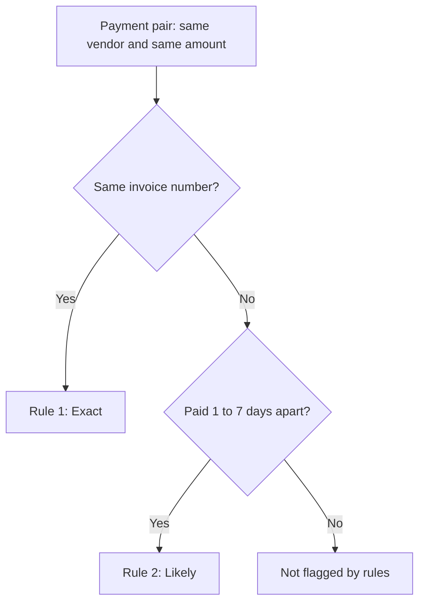

# Duplicate Payment Finder

Finds vendor payments that were probably made twice.

[](https://ridhimasharma11404-duplicate-payment-finder-app-7wxbxv.streamlit.app/)
[](https://www.python.org/)
[](LICENSE)

An accounts payable audit test built in Python. It scans a payment file for duplicate disbursements, quantifies the amount at risk, and checks its own detection rate against duplicates planted in the test data. Results are delivered as a dashboard, an Excel work paper and a one-page audit memo.

Dataset: synthetic, with illustrative vendor names.

## Results at a glance

| Item | Result |
|---|---|
| Population tested | 5,000 payments, 30 vendors, FY 2025 |
| Suspected duplicates flagged | 60 payments, INR 1.42 crore, 26 vendors |
| Planted duplicates detected | 60 of 70 (85.7% recall) |
| False alarms in the test data | 0 |
| Duplicates the rules missed | 10 (invoice-number typos paid 15 to 30 days apart) |
| ML extension | Caught all 4 typo cases the rules missed on held-out pairs |

Links: [Live dashboard](https://ridhimasharma11404-duplicate-payment-finder-app-7wxbxv.streamlit.app/) | [Audit memo](MEMO.md) | [Results work paper](results.xlsx) | [Power BI data](powerbi_data.xlsx) | [Dataset](payments.csv)

## Problem

Duplicate payments are a direct cash loss. They come from invoices submitted twice, invoices received through more than one channel, and small typos in invoice numbers. Each payment looks normal on its own, so they are rarely noticed without a systematic test.

## Approach

**Test data.** 5,000 payments across 30 vendors with 70 planted duplicates (30 Exact, 30 Likely, 10 Typo) and 20 legitimate recurring payments. Planting known duplicates makes it possible to measure how many the test finds.

**Two detection rules**

1. **Exact:** same vendor, same invoice number, same amount.
2. **Likely:** same vendor, same amount, different invoice number, paid 1 to 7 days apart.



## Findings

| Item | Result |
|---|---|
| Suspected duplicates | 60 payments |
| Amount at risk | INR 14,238,885.84 (about Rs 1.42 crore) |
| Vendors affected | 26 |
| Exact matches | 30 payments, INR 6,989,617.91 |
| Likely matches | 30 payments, INR 7,249,267.93 |

| Top vendors by exposure | Amount | Share |
|---|---|---|
| Dr Reddys Laboratories | INR 2,533,266.42 | 17.8% |
| BPCL Supplies | INR 1,114,023.59 | 7.8% |
| Marico Limited | INR 1,075,053.74 | 7.6% |

The top three vendors account for about 33% of the flagged amount. Exposure peaked in March 2025 at INR 2,627,310.98.

## Validation against planted duplicates

| Measure | Result |
|---|---|
| Planted duplicates | 70 |
| Caught | 60 |
| Missed | 10 |
| Recall | 85.7% |
| False alarms | 0 |

All 10 missed duplicates share one root cause: the invoice number was typed differently (for example INV-1001 and INV1001) and the payment was made 15 to 30 days later. Exact needs an identical invoice number and Likely needs a gap of 7 days or less, so neither rule applies. That gap in coverage motivated the ML extension below.

## ML extension: catching invoice-typo duplicates

A logistic regression was trained to score candidate pairs (same vendor, amount within Rs 50) as duplicate or not.

- **Candidate pairs:** 154 (70 duplicates, 84 non-duplicates)
- **Features:** days apart, invoice similarity (difflib ratio), amount difference, same invoice flag, same payer flag, standardized
- **Split:** 70/30 stratified, fixed seed: 107 training pairs, 47 test pairs

| Approach (47 held-out pairs) | Duplicates caught | Typo cases caught | False alarms |
|---|---|---|---|
| Rules (Exact + Likely) | 17 of 21 | 0 of 4 | 0 |
| Logistic regression | 21 of 21 | 4 of 4 | 1 |

The model recovered all four typo duplicates that the rules missed, at the cost of one false alarm. The payment-date gap carried the most weight, followed by amount difference and invoice similarity. This extension is a proof of concept on a small test set, and the rules remain the primary test.

## Dashboard

Streamlit app with three views: overview and trends (amount at risk by month, cumulative exposure, value distribution), a filterable table of suspected duplicates with CSV export, and detection accuracy with error analysis and the rules-versus-ML comparison.

## Scope and next steps

- Built and validated on synthetic data to demonstrate the method. The next step is running it on a real AP extract.
- Extend the test data with legitimate same-vendor, same-amount payments inside the 7-day window, to measure how many genuine payments the Likely rule flags.
- Add fuzzy vendor-name matching.
- Compare the model with a simple similar-invoice rule within 45 days.
- Every flagged payment goes to manual review against the invoice and bank record before any recovery request.

## Repository structure

```
.streamlit/config.toml     Dashboard theme
LICENSE                    MIT License
MEMO.md                    One-page audit memo
README.md                  This file
app.py                     Streamlit dashboard
generate_data.py           Synthetic data generator with planted duplicates
find_duplicates.py         Rule tests and error analysis
ml_step.py                 Candidate pairs, features, logistic regression
payments.csv               5,000-payment test dataset
results.xlsx               Findings, error sheets and ML comparison
powerbi_data.xlsx          Flat tables for Power BI
suspected_duplicates.csv   Flagged payments
missed.csv                 Missed duplicates with reasons
false_alarms.csv           False alarms
detection_accuracy.csv     Accuracy table
ml_vs_rules.csv            Rules versus ML comparison
requirements.txt           Python dependencies
```

## Run locally

```bash
git clone https://github.com/RidhimaSharma11404/duplicate-payment-finder.git
cd duplicate-payment-finder
pip install -r requirements.txt

python generate_data.py
python find_duplicates.py
python ml_step.py

streamlit run app.py
```

Tools: Python, pandas, scikit-learn, Streamlit.

## Author

Ridhima Sharma, [@RidhimaSharma11404](https://github.com/RidhimaSharma11404)
