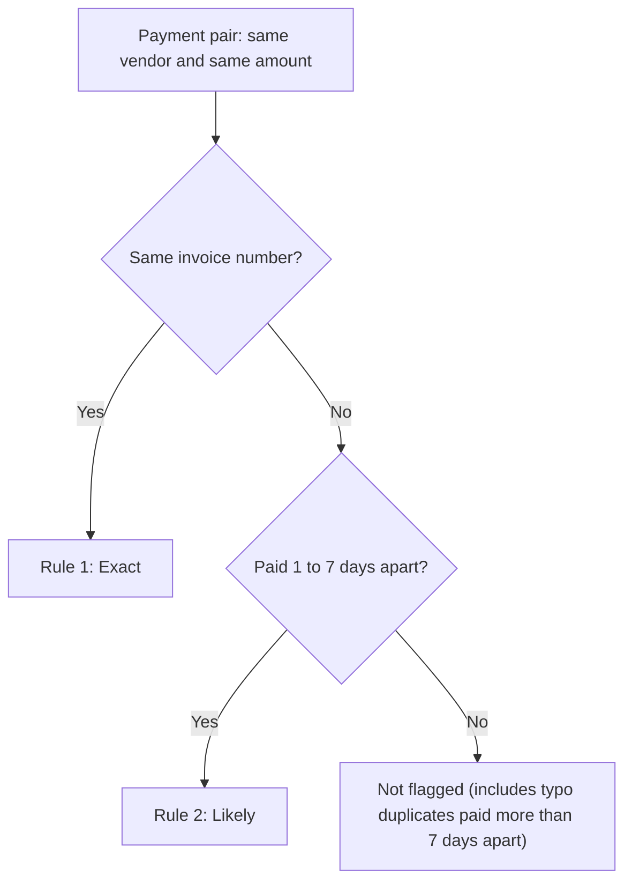

# Duplicate Payment Finder

Finds vendor payments that were probably made twice.

[](https://ridhimasharma11404-duplicate-payment-finder-app-7wxbxv.streamlit.app/)
[](https://www.python.org/)
[](LICENSE)

An accounts payable (AP) audit test. It looks for duplicate payments in a payment file, measures the amount at risk, and checks its own accuracy against duplicates planted in the test data. A dashboard and a one-page audit memo present the results.

> This is a portfolio project. The dataset is synthetic and the vendor names are illustrative. The findings are not from a real client.

## Key results

| Item | Result |
|---|---|
| Population tested | 5,000 payments, 30 vendors, 1 Jan to 31 Dec 2025 |
| Suspected duplicates flagged | 60 payments, INR 14,238,885.84 (about Rs 1.42 crore), 26 vendors |
| Planted duplicates caught | 60 of 70 (85.7% recall) |
| False alarms | 0 (100% precision) |
| Missed | 10, all invoice-number typos paid 15 to 30 days apart |

These figures come from synthetic data, so they show how the method works and do not predict results on real data.

## Links

| Resource | Link |
|---|---|
| Live dashboard | [Streamlit app](https://ridhimasharma11404-duplicate-payment-finder-app-7wxbxv.streamlit.app/) (free hosting, it may take about a minute to wake up) |
| Audit memo | [MEMO.md](MEMO.md) |
| Results and error analysis | [results.xlsx](results.xlsx) |
| Power BI data file | [powerbi_data.xlsx](powerbi_data.xlsx) |
| Test dataset (5,000 payments) | [payments.csv](payments.csv) |

## 1. Population and scope

Duplicate payments are a direct cash loss. They usually come from invoices submitted twice, invoices received through more than one channel, or small typos in invoice numbers. Each payment looks normal on its own, so they are easy to miss.

- **Population:** 5,000 payment records, fiscal year 2025, 30 illustrative vendors.
- **Planted duplicates (ground truth):** 70 payments: 30 Exact, 30 Likely (different invoice number, short gap), and 10 Typo (invoice number formatted differently, such as INV-1001 and INV1001, paid 15 to 30 days apart).
- **Planted legitimate repeats:** 20 recurring monthly payments, 30 to 60 days apart. These are not duplicates and are there to check for false alarms.

## 2. Test method

Two rules, both applied to pairs of payments.

1. **Exact:** same vendor, same invoice number, same amount.
2. **Likely:** same vendor, same amount, different invoice number, paid 1 to 7 calendar days apart.



## 3. Exceptions found

| Item | Result |
|---|---|
| Suspected duplicates | 60 payments |
| Amount at risk | INR 14,238,885.84 (about Rs 1.42 crore) |
| Vendors affected | 26 |
| Exact matches | 30 payments, INR 6,989,617.91 (about Rs 69.90 lakh) |
| Likely matches | 30 payments, INR 7,249,267.93 (about Rs 72.49 lakh) |

**Concentration**

| Vendor | Amount at risk | Share of total |
|---|---|---|
| Dr Reddys Laboratories | INR 2,533,266.42 | 17.8% |
| BPCL Supplies | INR 1,114,023.59 | 7.8% |
| Marico Limited | INR 1,075,053.74 | 7.6% |

The top three vendors account for about 33% of the flagged amount. The highest month was March 2025, at INR 2,627,310.98.

## 4. How reliable is the test

The 60 flagged payments were compared with the 70 planted duplicates.

| Measure | Result |
|---|---|
| Planted | 70 |
| Caught | 60 |
| Missed | 10 |
| False alarms | 0 |
| Recall | 85.7% (60 / 70) |
| Precision | 100.0% (60 / 60) |

**Why the 10 misses happened.** All 10 are typo cases (for example INV-1001 and INV1001) paid 15 to 30 days apart. The invoice numbers differ, so Exact does not match, and the gap is longer than 7 days, so Likely does not trigger.

**Why there were no false alarms.** The legitimate repeat payments were planted 30 to 60 days apart, so the 7-day rule never matched them. This is a weakness of the test data. See the limitations below.

## 5. Dashboard

The Streamlit app reads the results and has three views:

- **Overview:** summary figures, amount at risk by month, cumulative amount at risk, number of duplicates by amount, and days apart against amount.
- **Suspected duplicates:** a table filtered by match type and vendor, with CSV download.
- **Detection accuracy and errors:** planted, caught, missed, false alarms, recall and precision; the reasons for the misses; and the rules-versus-ML comparison.

## 6. Machine learning step (supporting experiment)

The audit result above comes from the two rules. This step is a small experiment to see whether a model can find the invoice-typo duplicates that the rules miss. It is not part of the main test.

### Method

- **Candidate pairs:** 154 pairs of payments with the same vendor and an amount within Rs 50 of each other. 70 are planted duplicates and 84 are not (legitimate repeat payments and other similar pairs).
- **Features (5):** `days_apart`, `invoice_similarity` (difflib character ratio), `amount_difference`, `same_invoice` (0 or 1), `same_paid_by` (0 or 1).
- **Model:** logistic regression with standardized features. The scaler is fitted on the training set only.
- **Split:** 70/30, stratified, fixed random seed (42): 107 training pairs and 47 test pairs.

### Standardized coefficients

| Feature | Coefficient |
|---|---|
| days_apart | -3.21 |
| amount_difference | -1.19 |
| invoice_similarity | +0.71 |
| same_invoice | +0.67 |
| same_paid_by | -0.14 |

The date gap carries the most weight. Pairs paid closer together are scored as more likely duplicates, and similar invoice numbers with the same amount add to that.

### Result on the 47 test pairs

| Approach | Duplicates caught | Typo cases caught | False alarms |
|---|---|---|---|
| Rules (Exact + Likely) | 17 of 21 (81.0% recall) | 0 of 4 | 0 |
| Logistic regression | 21 of 21 (100% recall) | 4 of 4 | 1 (95.5% precision) |

The model scored the 4 typo pairs the rules missed at 79% to 88% probability of being a duplicate, and raised one false alarm.

### How to read this result

- **The test set is small.** It has 47 pairs, 21 duplicates and 4 typo cases, so a single pair changes the result. An earlier run without feature scaling caught 3 of 4 typo cases with no false alarms. Treat the figures as indicative.
- **The figures are for candidate pairs only.** These pairs were already filtered to the same vendor and a similar amount, so they are not rates for all 5,000 payments. For the full population, the rules caught 60 of 70 planted duplicates (85.7%).
- **The data is synthetic.** Typo duplicates were planted 15 to 30 days apart and legitimate repeats 30 to 60 days apart. The model relies mostly on the date gap, so part of the result reflects how the data was built. All four typo test pairs also have the same invoice similarity (0.93), so the test does not show how the model handles other kinds of typos.
- **Real data would be harder.** About 45% of the candidate pairs are true duplicates. In a real payment file duplicates are much rarer, so precision would be lower.

## 7. Limitations

- The data is synthetic, and the planted duplicates and legitimate repeats were created by the same generator. Results on real payment data will differ.
- Legitimate repeat payments were all 30 to 60 days apart, so the Likely rule was never tested against real-looking repeats paid within 7 days. Expect false alarms there.
- Rule 2 covers a gap of 1 to 7 days. Payments with different invoice numbers outside that window, including typo duplicates, are not flagged by the rules.
- Vendor name variations (for example "Tata Motors" and "Tata Motors Ltd") are not tested.
- Every flagged payment needs a manual check against the invoice and the bank record. The tool produces a review list and does not prove a duplicate.

## 8. Next steps

- Check the ML result with cross-validation over all 154 pairs.
- Compare the model with a simple rule (similar invoice number, same vendor and amount, within 45 days), which may do as well.
- Add fuzzy vendor matching.
- Test on messier data with realistic legitimate repeats paid within 7 days.

## 9. Repository structure

```
.streamlit/config.toml     Dashboard theme
LICENSE                    MIT License
MEMO.md                    One-page audit memo (illustrative)
README.md                  This file
app.py                     Streamlit dashboard
generate_data.py           Synthetic data generator with planted duplicates
find_duplicates.py         Rule tests and error analysis
ml_step.py                 Candidate pairs, features, logistic regression
payments.csv               5,000-payment test dataset
results.xlsx               Findings, error sheets and ML comparison
powerbi_data.xlsx          Flat tables for Power BI
suspected_duplicates.csv   Flagged payments
missed.csv                 Missed duplicates with reasons
false_alarms.csv           False alarms (none in the current run)
detection_accuracy.csv     Accuracy table
ml_vs_rules.csv            Rules versus ML comparison
requirements.txt           Python dependencies
```

## 10. Run locally

```bash
git clone https://github.com/RidhimaSharma11404/duplicate-payment-finder.git
cd duplicate-payment-finder
pip install -r requirements.txt

python generate_data.py
python find_duplicates.py
python ml_step.py

streamlit run app.py
```

The app opens at `http://localhost:8501`.

Tools: Python, pandas, scikit-learn, Streamlit.

## 11. Author

Ridhima Sharma, [@RidhimaSharma11404](https://github.com/RidhimaSharma11404)
