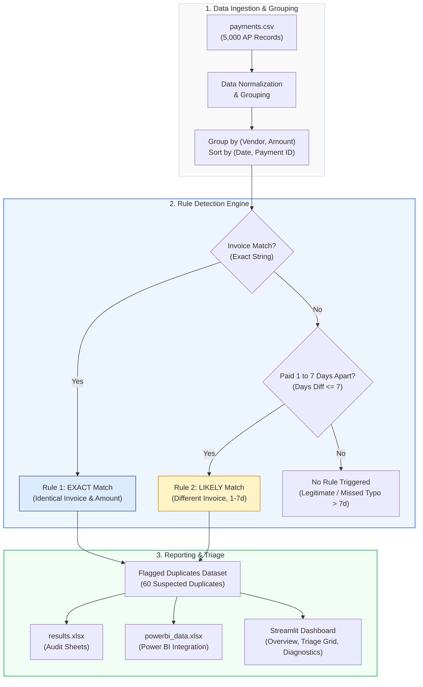

# Duplicate Payment Finder

[](https://ridhimasharma11404-duplicate-payment-finder-app-7wxbxv.streamlit.app/)
[](https://www.python.org/)
[](LICENSE)

Finds vendor payments that were probably made twice.

An audit analytics tool designed for Accounts Payable (AP) substantive testing. It detects suspected duplicate payments, quantifies financial risk, evaluates precision and recall against planted test data, and provides an interactive triage dashboard.

> *Note: Vendor names in the synthetic dataset are illustrative.*

---

## Links

| Resource | Link |
| :--- | :--- |
| Live Dashboard (Streamlit Cloud) | **[ridhimasharma11404-duplicate-payment-finder-app-7wxbxv.streamlit.app](https://ridhimasharma11404-duplicate-payment-finder-app-7wxbxv.streamlit.app/)** |
| GitHub Source Code | **[github.com/RidhimaSharma11404/duplicate-payment-finder](https://github.com/RidhimaSharma11404/duplicate-payment-finder)** |
| Audit Memorandum | **[MEMO.md](MEMO.md)** |
| Audit Results & Error Analysis | **[results.xlsx](results.xlsx)** |
| Power BI Data Model | **[powerbi_data.xlsx](powerbi_data.xlsx)** |
| Test Transaction Dataset (5,000) | **[payments.csv](payments.csv)** |

---

## 1. Population & Audit Scope

In accounts payable workflows, duplicate disbursements represent a direct source of cash leakage resulting from re-submitted invoices, multi-channel invoice intake, and minor reference typos.

Substantive testing was performed across an AP test population of **5,000 transactions** across 30 illustrative vendors for fiscal year 2025:
- **Total Population Tested:** 5,000 payment records
- **Audit Period:** January 1, 2025 to December 31, 2025
- **Planted Duplicates (Ground Truth):** 70 payments across 3 difficulty tiers (Exact, Likely with date lag, Typo format variations)
- **Planted Legitimate Repeats:** 20 recurring monthly payments (spaced 30–60 days apart) to test false alarm resistance

---

## 2. Substantive Testing Methodology

The rule-based detection engine (`find_duplicates.py`) implements two deterministic audit rules:

1. **Rule 1 — Exact Match:**
   - Identical vendor name, exact invoice number string match, and identical payment amount.
   - Identifies high-confidence duplicate payment entries.

2. **Rule 2 — Likely Match:**
   - Identical vendor name and payment amount, but differing invoice numbers, disbursed within **1 to 7 calendar days** of each other (matching the code implementation in `find_duplicates.py`).
   - Identifies duplicate invoices processed under alternative reference numbers.

---

## 3. Audit Exceptions & Findings

Substantive testing flagged **60 suspected duplicate disbursements** totaling **INR 14,238,885.84 (~₹1.42 Crore)** across **26 unique vendors**.

| Metric | Value |
| :--- | :--- |
| **Suspected Duplicates Flagged** | 60 payments |
| **Total Capital at Risk** | **INR 14,238,885.84 (~₹1.42 Crore)** |
| **Unique Vendors Affected** | 26 vendors |
| **Exact Matches (Rule 1)** | 30 payments \| **INR 6,989,617.91 (~₹69.90 Lakh)** |
| **Likely Matches (Rule 2)** | 30 payments \| **INR 7,249,267.93 (~₹72.49 Lakh)** |

### Concentration & Timing Analysis
- **Top 3 Vendors by Exposure:**
  1. *Dr Reddys Laboratories:* INR 2,533,266.42 (17.8% of total risk)
  2. *BPCL Supplies:* INR 1,114,023.59 (7.8% of total risk)
  3. *Marico Limited:* INR 1,075,053.74 (7.5% of total risk)
- **Peak Exposure Month:** March 2025 recorded the highest duplicate disbursement volume at **INR 2,627,310.98**.

---

## 4. Audit Conclusion & Ground Truth Validation

Comparing the 60 flagged items against the 70 planted ground-truth duplicates:

| Audit Evaluation Metric | Rule Engine Performance |
| :--- | :---: |
| **Planted Duplicates** | 70 payments |
| **Caught Duplicates** | 60 payments |
| **Missed Duplicates** | 10 payments |
| **False Alarms** | **0 payments** |
| **Overall Precision Rate** | **100.0%** (60 / 60) |
| **Overall Recall Rate** | **85.7%** (60 / 70) |

### Error Breakdown & Root Cause:
- **0 False Alarms (100.0% Precision):** Legitimate recurring payments in the dataset were spaced 30–60 days apart, so Rule 2 did not misclassify them.
- **10 Missed Duplicates (Typo Cases with Gap > 7 Days):** These transactions were planted with typographical formatting differences (e.g. `INV-1001` vs `INV1001`) and paid with a **15–30 day gap**. Because invoice numbers differed, Rule 1 did not match; and because the payment gap exceeded 7 days, Rule 2 did not trigger.

---

## 5. System Pipeline & Decision Tree




---

## 6. Dashboard Features

The web application provides three operational views:

1. **Overview & Trends:**
   - 5 KPI summary cards (Capital at Risk, Suspected Duplicates, Precision, Vendors Affected, Mean Duplicate Value).
   - **Amount at risk by month:** 12-month trend line showing monthly risk distribution.
   - **Cumulative amount at risk:** Cumulative financial exposure curve tracking towards ₹1.42 Crore.
   - **Number of duplicates by amount:** Value tier distribution histogram.
   - **Days apart vs amount:** Scatter plot color-coded by match tier.

2. **Suspected Duplicates (Triage Grid):**
   - Multi-select match type filters (`Exact`, `Likely`) and vendor dropdown.
   - Searchable, sorted data table with transaction metadata.
   - Direct CSV export for audit workpapers.

3. **Detection Accuracy & Errors:**
   - Ground truth validation matrix (Planted, Caught, Missed, False Alarms, Recall %, Precision %).
   - Root-cause breakdown table detailing reasons for missed disbursements.
   - **Rules vs ML (test pairs)** comparative evaluation table.

---

## 7. Machine Learning Step (`ml_step.py`)

As an additional experiment to test whether statistical learning could capture formatting edge cases that rules miss, a lightweight Machine Learning step (`ml_step.py`) was evaluated on candidate pairs.

### How the Model Works
1. **Candidate Pair Generation:** Forms pairwise combinations of payments with identical vendor names and an amount difference $\le$ ₹50 (154 candidate pairs: 70 true duplicates, 84 non-duplicates/recurring).
2. **Feature Engineering:** Computes 5 pairwise features: `days_apart`, `invoice_similarity` (character ratio via `difflib`), `amount_difference`, `same_invoice` (0/1), and `same_paid_by` (0/1).
3. **Training & Feature Scaling:** Candidate pairs are split 70/30 (`random_state=42`) stratified by label (107 training pairs, 47 held-out test pairs). Features are standardized using `StandardScaler` fitted on the training set only.
4. **Learned Standardized Coefficients:**

| Feature | Standardized Coef | Direction & Interpretation |
| :--- | :---: | :--- |
| `days_apart` | **-3.2138** | **Carried the most weight:** Strongly decreases duplicate log-odds as payment gap widens |
| `amount_difference` | **-1.1850** | Decreases duplicate log-odds with amount variance |
| `invoice_similarity` | **+0.7056** | Increases duplicate log-odds with character overlap |
| `same_invoice` | **+0.6667** | Increases duplicate log-odds |
| `same_paid_by` | **-0.1408** | Mild negative/neutral weight |
| *Intercept* | **-1.5143** | Base log-odds threshold |

> *The model learned that the **date gap carried the most weight** (-3.2138), with invoice similarity and amount difference serving as secondary signals.*

### Test Set Comparison: Rules vs ML (47 Held-Out Test Pairs)

Comparing deterministic rules and the Logistic Regression model on the exact same **47 held-out test pairs**:

| Approach | Precision | Recall | Typo Duplicates Caught |
| :--- | :---: | :---: | :---: |
| **Detection Rules (Exact + Likely)** | **100.0%** (0 false alarms) | **81.0%** | **0 / 4** |
| **Logistic Regression ML Model** | **95.5%** (1 false alarm) | **100.0%** | **4 of 4** |

> **Key Observation:** On the held-out test set, the standardized ML model caught **4 of the 4 typo cases** (with predicted probabilities from 79.1% to 87.5%), increasing recall on test pairs from 81.0% to 100.0% with 1 false alarm (95.5% precision).

### Limitations
- **Synthetic Data & Optimistic Precision:** These are results on synthetic data, so lower precision is expected on real data. In the test dataset, legitimate repeat payments were spaced 30–60 days apart, making them easy to separate from duplicates.
- **Small Test Sample:** The held-out test split comprises 47 candidate pairs (with 4 planted typo cases). While catching 4 of 4 is a clean result, performance estimates on small samples carry statistical variance.
- **Generator Distribution:** Labels originate from synthetic generation logic, so the model partly reflects the underlying synthetic distribution.

---

## 8. Repository Structure

```text
├── .streamlit/
│   └── config.toml          # Dashboard theme configuration
├── LICENSE                  # MIT License
├── MEMO.md                  # Executive Audit Memorandum
├── README.md                # Project documentation and audit methodology
├── app.py                   # Streamlit dashboard application
├── find_duplicates.py       # Rule detection and error analysis engine
├── ml_step.py               # ML candidate pair classifier & evaluation
├── generate_data.py         # Synthetic AP data generator with planted edge cases
├── payments.csv             # 5,000 transaction Accounts Payable test dataset
├── results.xlsx             # Sourced audit findings, error sheets & ML comparison
├── powerbi_data.xlsx        # Structured flat tables for Power BI integration
└── requirements.txt         # Python package dependencies
```

---

## 9. Local Setup & Execution

### 1. Clone Repository
```bash
git clone https://github.com/RidhimaSharma11404/duplicate-payment-finder.git
cd duplicate-payment-finder
```

### 2. Install Dependencies
```bash
pip install -r requirements.txt
```

### 3. Generate Dataset, Run Detection & ML Evaluation
```bash
python generate_data.py
python find_duplicates.py
python ml_step.py
```

### 4. Launch Streamlit Application
```bash
streamlit run app.py
```
The application will open automatically at `http://localhost:8501`.

---

## 10. Audit Limitations & Future Roadmap

- **Fuzzy Vendor Matching:** Incorporate string distance algorithms to catch vendor spelling variations and alias discrepancies.
- **Testing on Real-World Datasets:** Validate the detection rules and ML feature weights on larger, messy AP populations with real OCR and intake variations.

---

## 11. Author

- **Author:** Ridhima Sharma
- **GitHub:** [@RidhimaSharma11404](https://github.com/RidhimaSharma11404)
- **Live App:** [Streamlit Cloud Deployment](https://ridhimasharma11404-duplicate-payment-finder-app-7wxbxv.streamlit.app/)
