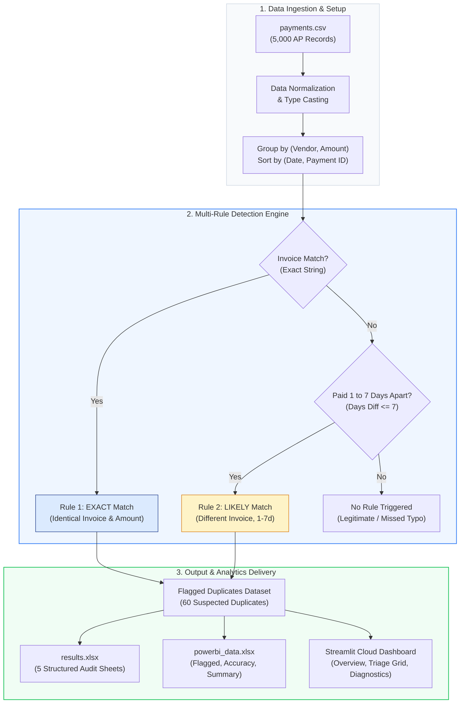
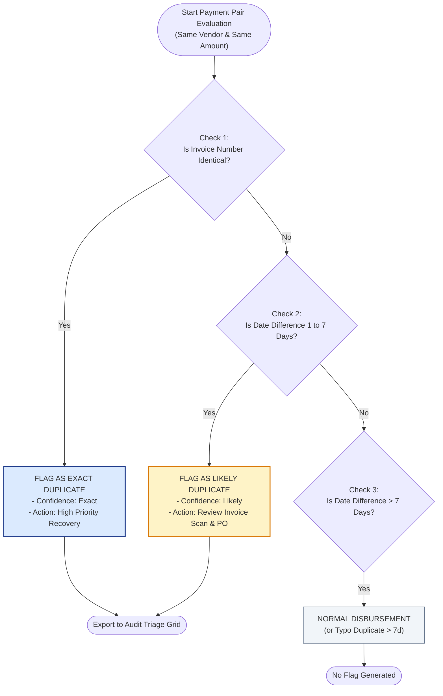
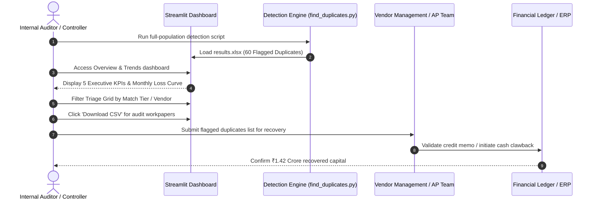

# Duplicate Payment Finder

[](https://ridhimasharma11404-duplicate-payment-finder-app-7wxbxv.streamlit.app/)
[](https://www.python.org/)
[](LICENSE)

An audit analytics tool designed for Accounts Payable (AP) substantive testing. It detects suspected duplicate disbursements, quantifies financial risk, evaluates model precision and recall against planted ground truth, and provides an interactive triage dashboard.

---

## 📌 Links

| Resource | Link |
| :--- | :--- |
| 🚀 **Live Dashboard (Streamlit Cloud)** | **[ridhimasharma11404-duplicate-payment-finder-app-7wxbxv.streamlit.app](https://ridhimasharma11404-duplicate-payment-finder-app-7wxbxv.streamlit.app/)** |
| 💻 **GitHub Source Code** | **[github.com/RidhimaSharma11404/duplicate-payment-finder](https://github.com/RidhimaSharma11404/duplicate-payment-finder)** |
| 📊 **Audit Results & Error Analysis** | **[results.xlsx](results.xlsx)** |
| 📈 **Power BI Data Model** | **[powerbi_data.xlsx](powerbi_data.xlsx)** |
| 📁 **Raw Transaction Population (5,000)** | **[payments.csv](payments.csv)** |

---

## 1. System Architecture & Pipeline



---

## 2. Detection Decision Tree



---

## 3. End-to-End Audit & Triage Workflow



---

## 4. Problem Overview

In enterprise procurement and accounts payable environments, duplicate payments represent a major source of financial leakage. Duplicate disbursements typically arise from:
- Re-submitted invoices following payment inquiries or delayed processing.
- Multi-channel invoice intake (e.g., invoices received via email and vendor portal simultaneously).
- Minor invoice number typographical variations and overlapping payment approval workflows.

Without systematic audit testing, duplicate disbursements often go unnoticed, directly impacting working capital.

---

## 5. Detection Methodology & Rules

The engine implements a multi-tier detection methodology:

1. **Rule 1 — Exact Match:**
   - Same vendor name, identical invoice number, and exact payment amount.
   - High-confidence duplicate payment instances.

2. **Rule 2 — Likely Match:**
   - Same vendor name and exact payment amount, but different invoice numbers, disbursed within 1 to 7 calendar days of each other.
   - Captures duplicate invoice entries processed under alternative reference numbers.

---

## 6. Detection Benchmark & Accuracy

The detection engine was evaluated across an AP testing population of **5,000 transactions** across 30 enterprise vendors for fiscal year 2025:

| Metric | Value |
| :--- | :--- |
| **Total AP Population Tested** | 5,000 transactions |
| **Planted Duplicates (Ground Truth)** | 70 payments |
| **Caught Duplicates** | 60 payments |
| **Missed Duplicates** | 10 payments |
| **False Alarms** | 0 payments |
| **Recall Rate** | **85.7%** (60 / 70) |
| **Precision Rate** | **100.0%** (60 / 60) |
| **Suspected Duplicates Flagged** | 60 payments |
| **Total Capital at Risk** | **INR 14,238,885.84 (~₹1.42 Crore)** |
| **Unique Vendors Affected** | 26 vendors |

### Breakdown by Match Confidence
- **Exact Matches:** 30 disbursements | **INR 6,989,617.91**
- **Likely Matches:** 30 disbursements | **INR 7,249,267.93**

---

## 7. Error Diagnostics & Miss Root-Causes

- **Missed Duplicates (10 items):**
  - **Typo in Invoice Number (10 cases):** These transactions were intentionally planted with typographical formatting differences (e.g., `INV-1001` vs `INV1001`) and paid more than 7 days apart. Because exact string equality is enforced, exact rules do not capture non-identical strings.
- **False Alarms (0 items):**
  - Evaluating matched pairs against ground truth pairs generated **zero false alarms** (100.0% precision).

---

## 8. Dashboard Features

The web application provides three operational views:

1. **Overview & Trends:**
   - 5 Executive KPI metric cards (Capital at Risk, Suspected Duplicates, Precision, Vendors Affected, Mean Duplicate Value).
   - **Amount at risk by month:** 12-month linear trend line identifying risk concentration peaks.
   - **Cumulative amount at risk:** Year-to-date cumulative financial exposure curve.
   - **Number of duplicates by amount:** Value tier distribution histogram.
   - **Days apart vs amount:** Scatter plot color-coded by match tier (Navy for Exact, Amber for Likely).

2. **Suspected Duplicates (Triage Grid):**
   - Multi-select match type filters (`Exact`, `Likely`) and vendor dropdown.
   - Searchable, sorted data table with full transaction metadata and audit reference numbers.
   - Direct CSV export for audit workpaper documentation.

3. **Detection Accuracy & Errors:**
   - Full model performance matrix (Planted, Caught, Missed, False Alarms, Recall %, Precision %).
   - Root-cause breakdown table detailing reasons for missed disbursements.

---

## 9. Repository Structure

```text
├── .streamlit/
│   └── config.toml          # Dashboard theme configuration
├── app.py                   # Streamlit web dashboard application
├── find_duplicates.py       # Multi-rule detection and error analysis engine
├── generate_data.py         # Synthetic AP data generator with planted edge cases
├── payments.csv             # 5,000 transaction Accounts Payable population
├── results.xlsx             # Sourced audit findings and error sheets
├── powerbi_data.xlsx        # Structured flat tables for Power BI integration
├── requirements.txt         # Python package dependencies
├── .gitignore               # Git ignore rules
└── README.md                # Project documentation, flow diagrams and audit methodology
```

---

## 10. Local Setup & Execution

### 1. Clone Repository
```bash
git clone https://github.com/RidhimaSharma11404/duplicate-payment-finder.git
cd duplicate-payment-finder
```

### 2. Install Dependencies
```bash
pip install -r requirements.txt
```

### 3. Generate Dataset & Run Detection
```bash
python generate_data.py
python find_duplicates.py
```

### 4. Launch Streamlit Application
```bash
streamlit run app.py
```
The application will open automatically at `http://localhost:8501`.

---

## 11. Limitations & Future Roadmap

- **Fuzzy Matching:** Integrate approximate string matching (e.g., Levenshtein distance) to identify invoice typographical errors and vendor alias variations.
- **Amount Variance Tolerance:** Introduce configurable tolerance bands (e.g., +/- ₹50) to catch minor currency conversion and rounding variations.
- **Recurring Payment Intelligence:** Automated identification and exclusion of monthly retainer series to prevent recurring false alarms.

---

## 12. Author

- **Author:** Ridhima Sharma
- **GitHub:** [@RidhimaSharma11404](https://github.com/RidhimaSharma11404)
- **Live App:** [Streamlit Cloud Deployment](https://ridhimasharma11404-duplicate-payment-finder-app-7wxbxv.streamlit.app/)
